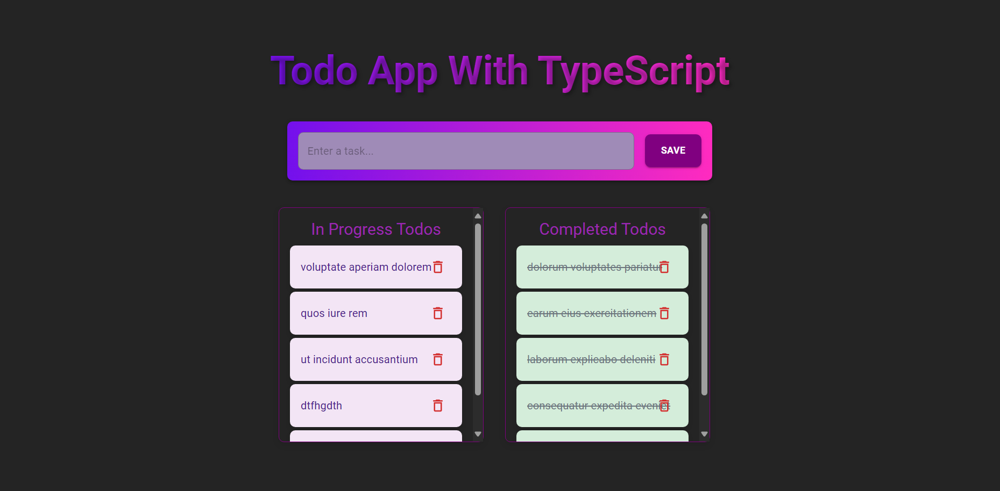

# FS-TS Todo App (React + TypeScript + Node.js + PostgreSQL)

A fullstack Todo application built with:

- **Frontend:** React 19 + TypeScript + Vite + Material UI
- **Backend:** Node.js + Express + Sequelize
- **Database:** PostgreSQL (containerized with Docker)
- **HTTP Client:** Axios

This project is a fullstack Todo application developed with React and TypeScript on the frontend, and Node.js + Express on the backend.  
It is designed with Material UI components, optimized with Vite, and powered by a PostgreSQL database (via Sequelize ORM), with Docker-based local development support.

---

## Live Demo

> Add your links here after deployment:

- **Frontend (Netlify/Vercel):** `https://your-frontend-url.com`
- **Backend API (Render/Railway):** `https://your-api-url.com`

---

## Screenshots



---

## Project Goals

- Merge an existing TypeScript frontend with a separate Todo API backend.
- Replace SQLite usage with **PostgreSQL**.
- Run the stack in a reproducible local environment using **Docker**.
- Prepare the app for deployment and portfolio presentation.

---

## Tech Stack

### Frontend
- React 19
- TypeScript
- Vite
- Material UI
- Axios

### Backend
- Node.js
- Express
- Sequelize ORM
- express-async-errors
- CORS
- dotenv

### Database
- PostgreSQL 16 (Docker container)

### DevOps / Tooling
- Docker & Docker Compose
- ESLint
- TypeScript strict mode

---

## Monorepo Structure

```bash
.
├── src/                      # Frontend (React + TS)
│   ├── components/
│   ├── pages/
│   ├── App.tsx
│   ├── main.tsx
│   └── typescript.d.ts
├── server/                   # Backend (Express + Sequelize)
│   ├── controllers/
│   ├── middlewares/
│   ├── models/
│   ├── routes/
│   ├── app.js
│   ├── package.json
│   └── .env
├── docker-compose.yml        # PostgreSQL + API services
├── package.json              # Frontend package.json
└── README.md
```

---

## Features

- Add a new todo
- List all todos
- Toggle todo completion (`isDone`)
- Delete a todo
- Split view for "In Progress" and "Completed"
- API-driven data flow (no local mock API)

---

## API Endpoints

Base URL (local):
- `http://localhost:8000`

Routes:
- `GET /todos` → list todos
- `POST /todos` → create todo
- `GET /todos/:id` → get one todo
- `PUT /todos/:id` → update todo
- `DELETE /todos/:id` → delete todo

Typical todo shape in backend:
```json
{
  "id": 1,
  "title": "Buy milk",
  "description": "",
  "priority": 0,
  "isDone": false,
  "createdAt": "2026-03-14T12:00:00.000Z",
  "updatedAt": "2026-03-14T12:00:00.000Z"
}
```

---

## Data Mapping Note (Important)

The backend model uses `title`, while frontend UI may display `task` text conceptually.

In this project:
- **Request payloads to backend should use `title`**
- Frontend can map backend data to UI-friendly format when needed

Example:
- Create: `{ title: "My Task", isDone: false }`
- Update: `{ title: todo.title, isDone: !todo.isDone }`

---


## Running Locally

## 1) Clone the repository

```bash
git clone https://github.com/recep-demir/todo-app-ts.git
cd todo-app-ts
```

## 2) Start backend + PostgreSQL with Docker

```bash
docker compose up --build
```

This starts:
- PostgreSQL container (`db`)
- Backend API container (`api`)

## 3) Start frontend (new terminal)

```bash
npm install
npm run dev
```

Vite will run at:
- `http://localhost:5173` or `http://localhost:5174`

Backend:
- `http://localhost:8000`

---

## CORS Troubleshooting

If you see browser errors like:

- `No 'Access-Control-Allow-Origin' header`
- `blocked by CORS policy`

Check:
1. Frontend origin port (5173 vs 5174)
2. `CORS_ORIGINS` in `server/.env`
3. Restart containers after changes:

```bash
docker compose down
docker compose up --build
```

---

## Common Problems & Fixes

### 1) Todos not being created
Make sure POST payload uses **`title`**, not `task`.

### 2) Network Error in Axios
Usually caused by:
- backend not running
- wrong API URL
- CORS config mismatch

### 3) Docker DB connection issues
Ensure backend uses:
- host = `db` (service name in Docker network)
- not `localhost` inside container

---

## Build Commands

### Frontend
```bash
npm run build
npm run preview
```

### Backend
```bash
cd server
npm install
npm start
```

---

## Deployment Plan (Suggested)

### Frontend
- Netlify or Vercel
- Set production API base URL

### Backend
- Render / Railway
- Use managed PostgreSQL (Neon/Supabase/Render Postgres)
- Set environment variables in hosting dashboard

### Required production env vars
- `PORT`
- `DATABASE_URL`
- `CORS_ORIGINS` (your frontend domain)

---

## Future Improvements

- Authentication (JWT)
- Form validation
- Pagination/filter/sorting
- Unit/integration tests
- CI/CD (GitHub Actions)
- Better UX states (loading/error/empty)

---

## License

MIT License.

---

## Author

**Recep Demir**

- GitHub: [@recep-demir](https://github.com/recep-demir)
- Portfolio: _add your portfolio link here_