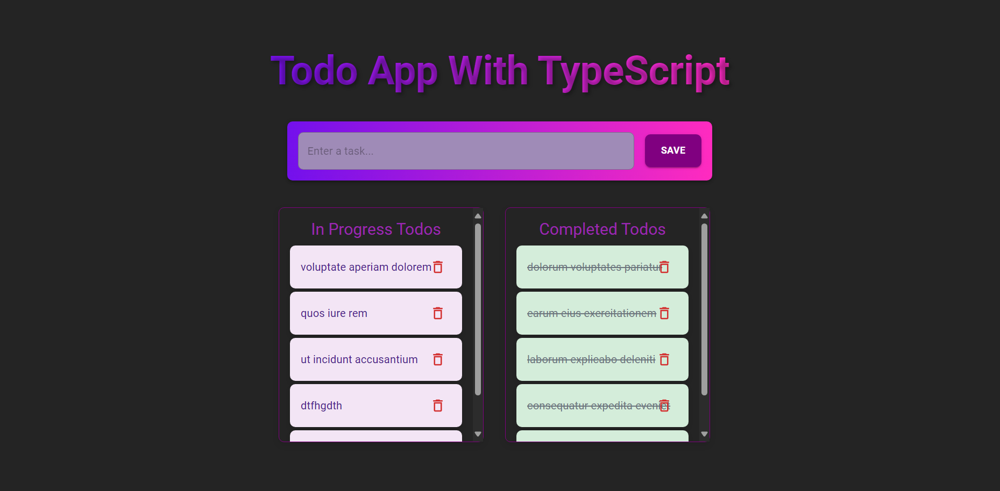

[Live Demo](https://todo-app-ts01.netlify.app/)
## Screenshots


# Todo App

This project is a Todo application developed using React and TypeScript. It is designed with Material UI components and optimized with Vite.

## Technologies

The key technologies used in this project:

- React 19
- TypeScript
- Vite
- Material UI (@mui/material & @mui/icons-material)
- Axios
- ESLint

## Installation

Follow these steps to run the project locally:

```sh
# Clone the repository
git clone https://github.com/recep-demir/todo-app-ts.git

# Navigate to the project folder
cd todo-app-ts

# Install dependencies
yarn install  # or npm install

# Start the development server
yarn dev  # or npm run dev
```

## Features

- Users can add new tasks.
- Added tasks are listed.
- Tasks can be completed or deleted.
- Responsive design.

##  Project Structure

```plaintext
src/
│── components/
│   ├── AddTodo.tsx
│   ├── Header.tsx
│   ├── TodoList.tsx
│   ├── TodoListItems.tsx
│── pages/
│   ├── Home.tsx
│── App.tsx
│── App.css
│── main.tsx
│── vite.config.ts
```

### Components

- **AddTodo.tsx**: Allows users to add new tasks.
- **Header.tsx**: Contains the application header bar.
- **TodoList.tsx**: Lists existing tasks.
- **TodoListItems.tsx**: Represents each task item.

### Pages

- **Home.tsx**: The main page component that integrates all components.

### Other Files

- **App.tsx**: The main application component.
- **App.css**: General styles.

##  Development

Run ESLint with the following command to maintain code quality:

```sh
yarn lint  # or npm run lint
```

##  Live Preview

To build and preview the generated package:

```sh
yarn build && yarn preview  # or npm run build && npm run preview
```

##  Deployment

Use the `build` folder to deploy the project to a hosting service.

##  Contribution

If you want to contribute, please open an **issue** first. Then, submit a PR with your suggested changes.

## License

This project is released under the MIT license.

